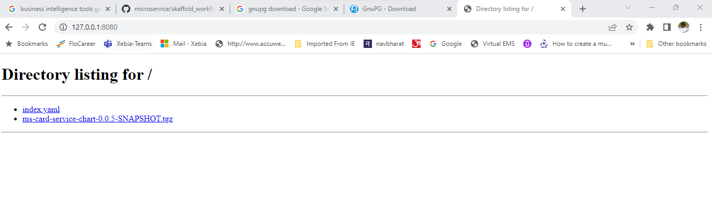

### Helm Practise Example helm-kubernetes-packaging-manager-for-developers-and-devops

Udemy Course-> https://xebia.udemy.com/course/helm-kubernetes-packaging-manager-for-developers-and-devops

1. For any helm updates visit the https://helm.sh/docs/ site
2. For all bitnami repository charts visit the https://bitnami.com/stacks/helm
3. If you are looking for source code referred in chart visit https://github.com/bitnami/charts/tree/main/bitnami
4. For installing helm on windows use command "choco install kubernetes-helm"
5. For helm command list kindly referrer the helm+install+commands.txt in this project root directory
   [helm+install+commands.txt](helm%2Binstall%2Bcommands.txt)

### Create local chart repository
1) create a folder chartsrepo
2) --- helm repo index chartsrepo/
The above command will create index.yaml inside chartsrepo folder
3) Package any local chart to the folder chartsrepo
   --- helm package helm/firstchart -d chartsrepo/
4) Now add the newly added chart in index.yaml using following command
   --- helm repo index .

docker run -d -p 5000:5000 --restart always --name registry registry:2

Push chart to oci registry
helm push myappchart-0.1.0.tgz oci://localhost:5000
helm show all oci://localhost:5000/myappchart --version 0.1.0
helm pull oci://localhost:5000/myappchart --version 0.1.0
helm template oci://localhost:5000/myappchart --version 0.1.0
helm install oci://localhost:5000/myappchart --version 0.1.0 --generate-name

On Docker hub

helm push myapp3chart-0.1.0.tgz oci://registry-1.docker.io/amsidhmicroservice
helm show all oci://registry-1.docker.io/amsidhmicroservice/myappchart --version 0.1.0
helm template oci://registry-1.docker.io/amsidhmicroservice/myapp2chart --version 0.1.0
helm show all oci://registry-1.docker.io/amsidhmicroservice/myappchart --version 0.1.0

### Securing the image using GPG
Install GPG from https://gnupg.org/download/
Check installation using 
--- gpg --version
Generate the GPG key using following command.
--- gpg --full-generate-key
Generated keys are stored in directory  C:\Users\amsid\AppData\Roaming\gnupg\
Key extension files are .kbx. For helm we need to export these key in gpg format using following command.
--- gpg --export-secret-keys > C:\Users\amsid\AppData\Roaming\gnupg\secring.gpg

Create a sample chart
--- helm create firstchart
Now package the helm chart using above gpg key file
--- helm package --sign --key amsidhlokhande@gmail.com --keyring C:\Users\amsid\AppData\Roaming\gnupg\secring.pgp firstchart -d chartsrepo
--- helm repo index chartsrepo

Install python3 and launch web server using command from the chartsrepo.
--- python3 --version
--- python3 -m http.server --bind 127.0.0.1 8080

check http://localhost:8080 and see the charts are available there 

add the repository to local helm.

helm repo ls
helm repo add localrepo http://localhost:8080
--- helm install --verify --keyring C:\Users\amsid\AppData\Roaming\gnupg\secring.pgp firstchart localrepo/firstchart

